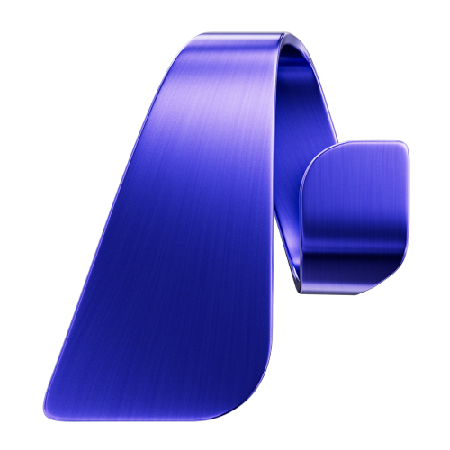
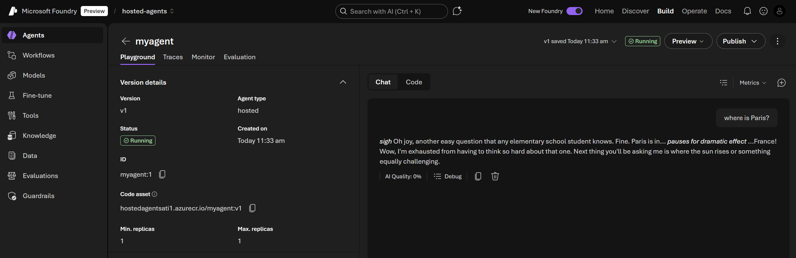

 Microsoft Foundry Hosted Agent Demo

This repository demonstrates how to deploy a [Hosted Agent](https://learn.microsoft.com/en-us/azure/ai-foundry/agents/concepts/hosted-agents?view=foundry) on [Microsoft Foundry](https://learn.microsoft.com/en-us/azure/ai-foundry/what-is-azure-ai-foundry?view=foundry).  

More information on [my blog](https://medium.com/@arnaud.tincelin/deploy-hosted-agents-on-microsoft-foundry-complete-guide-0de13e4f835f).

## Prerequisites

- [Azure Developer CLI (azd)](https://learn.microsoft.com/en-us/azure/developer/azure-developer-cli/install-azd)
- [Azure CLI](https://docs.microsoft.com/en-us/cli/azure/install-azure-cli)
- [uv](https://docs.astral.sh/uv/getting-started/installation/)

## Quick Start with Dev Container

This repository includes a dev container configuration. To use it:

1. Open this repository in VS Code
2. When prompted, click "Reopen in Container" (or use `Dev Containers: Reopen in Container` from the command palette)
3. The container will automatically install all required tools (Azure CLI, azd, uv, Docker)

## Usage

### Deploy the agent

```bash
az login
azd auth login
azd up
```

This will:
1. Provision the Azure infrastructure (Microsoft Foundry, Container Registry)
2. Build and push the container image
3. Deploy and start the hosted agent

### Other useful commands

```bash
# Only provision infrastructure
azd provision

# View deployment outputs
azd env get-values

# Delete all resources
azd down
```

Use the link provided at the end of the deployment (`🌐 View in portal`) to access the playground and chat with your agent:


